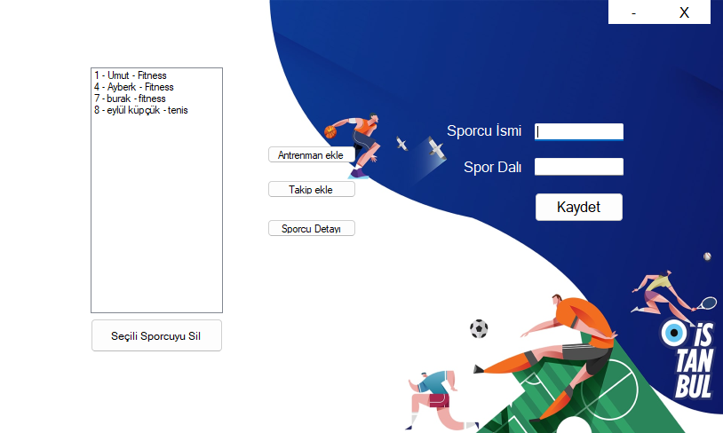
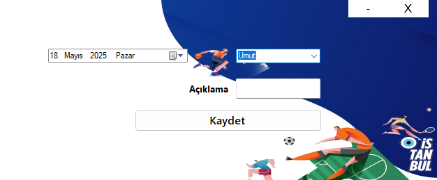
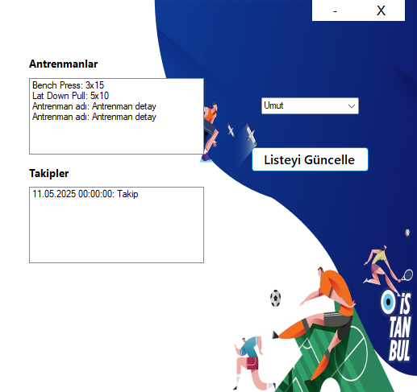

# 🏋️‍♂️ Spor Takip Uygulaması

Bu uygulama, sporcuların antrenman ve gelişim süreçlerini takip etmek amacıyla geliştirilmiş bir masaüstü yazılımıdır. C# Windows Forms ile hazırlanmış olup SQL Server veritabanı kullanmaktadır.

## 🚀 Kurulum

Projeyi kullanabilmek için aşağıdaki adımları takip edin:

1. **Veritabanını Yükleme**  
   Proje klasöründeki `SporTakip.bak` dosyasını kendi SQL Server sunucunuza **restore** edin.

2. **Visual Studio Ayarları**  
   Visual Studio ile projeyi açın ve `DatabaseHelper.cs` dosyasındaki bağlantı cümlesini kendi SQL Server ayarlarınıza göre düzenleyin.

3. **Programı Çalıştırın**  
   Gerekli ayarlamaları yaptıktan sonra projeyi çalıştırabilirsiniz.

---

## 👤 Sporcu Ekleme

1. `Sporcu Adı` kısmına adı yazın (örn: **Ayberk Arda**)  
2. `Spor Dalı` kısmına branşı yazın (örn: **Yüzme**)  
3. `Kaydet` butonuna basın  
4. Sporcu listede görünür

---

## 🏃‍♂️ Antrenman Ekleme

1. Ana ekranda `Antrenman Ekle` butonuna tıklayın  
2. Açılan pencerede:  
   - Sporcu listesinden birini seçin  
   - Antrenman adını girin (örn: **Göğüs Günü**)  
   - Detaylarını yazın (örn: **Chest Press, Incline Dumbbell Press**)  
3. `Kaydet` butonuna tıklayın

---

## 📅 Takip Kaydı Ekleme

1. Ana ekranda `Takip Kaydı Ekle` butonuna tıklayın  
2. Açılan formda:  
   - Sporcu seçin  
   - Takip tarihini belirleyin  
   - Açıklama girin (örn: **Ağırlık: 95kg, setler tamamlandı**)  
3. `Kaydet` butonuna tıklayın

---

## 📊 Sporcu Geçmişi Görüntüleme

1. Ana ekranda `Sporcu Detayları` butonuna tıklayın  
2. Açılan formda:  
   - Sporcu seçin  
   - Seçilen sporcuya ait antrenmanlar ve takip kayıtları listelenir  
   - İsteğe bağlı olarak `Güncelle` butonuna basarak verileri güncelleyebilirsiniz

---

## 🖼️ Ekran Görüntüleri

### Ana Sayfa

### Antrenman Ekle

### Takip Kaydı Ekle

### Sporcu Detayı

